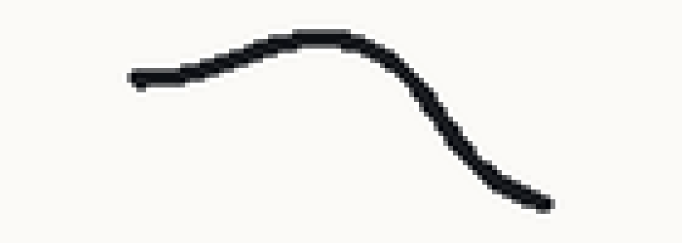
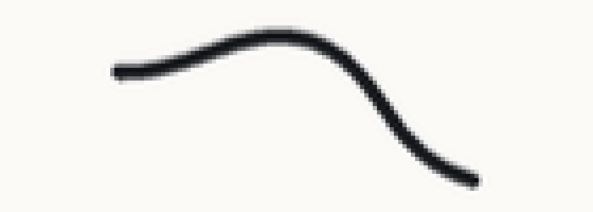

# Diagnosing a bad stroke

> **Status: complete first draft.** Tracked in [#8](https://github.com/TheSevenPens/devnotes/issues/8).

## Overview

A pen stroke can go wrong in at least four separate ways. On screen they resemble each other closely enough that people describe all four with the same words, which sends the investigation toward the wrong part of the code. This page helps you tell the four apart, then fix the one you actually have.

It covers five things:

- Deciding whether the stroke really looks wrong
- Matching a symptom to a cause
- Detecting each cause
- Fixing each cause
- Judging your own measurements

Here are some notes:

- Nothing here depends on a particular UI framework
- The worked examples come from the six Scribble samples in WinPenKit
- Those samples carry two diagnostic flags, `--selftest` and `--replay`, which do most of the work described below
- Section 5 gives the arithmetic for taking the same measurements in an application of your own

---

## 1. Symptoms

Keep the following in mind before you start:

- Four faults account for almost every stroke that looks wrong
- People reach for the same words to describe all four
- Separating them narrows the search before you read any code
- All four can hide at 1:1, so zoom to 3x or 4x before judging anything

| symptom | what you see | where it comes from |
| --- | --- | --- |
| **Faceted** | straight segments meeting at visible angles, worst on slow curves | quantized coordinates |
| **Blocky** | stair-steps larger than one pixel, the same size everywhere | a surface magnified without filtering |
| **Soft** | every edge hazy by the same amount, often on one axis only | a surface resampled to a fractional pixel offset |
| **Lumpy** | the path looks right, the width bulges and pinches | the pressure path |

### What each one looks like

Every image below draws the same path with one fault applied, magnified 6x so the device pixels show. They demonstrate the mechanisms rather than capture the original bugs: a script builds them from WinPenKit's reference stroke and introduces each fault deliberately, so the only thing that differs between any two images is the fault. See [Generating the symptom images](generating-symptom-images.md), which also covers turning the same constructions into test input for your own checks.

**Clean**, for comparison. Smooth path, correct pixels.


**Faceted.** The pixels stay correct and the path turns angular. Every coordinate here got rounded to a whole device pixel, which is what an integer-typed API does to a pen position.



**Blocky.** The path stays correct and the pixels grow. This surface holds 44% of the pixels it needs, magnified back with no filtering.


**Soft.** Neither the path nor the resolution changed. The surface sits 0.64 device pixels off the pixel grid vertically, so every edge picks up a row of intermediate greys.



**Lumpy.** The path stays correct and the width carries the fault. Nothing in the position pipeline produces this.


### Telling them apart

Four questions, each of which eliminates at least one candidate:

- **Does it change with drawing speed?** Faceting worsens as you slow down: the samples land closer together, so each one-pixel error turns a larger angle. The other three ignore speed.
- **Does it affect anything other than strokes?** A magnified or resampled surface degrades everything drawn on it. Stamp a ring of antialiased circles and look at those instead. If the circles also look wrong, suspect the surface rather than the stroke.
- **Does it appear on one axis only?** A fractional offset on a single axis blurs only that axis, so a stroke running parallel to the clean axis still looks sharp. That asymmetry makes this fault the easiest of the four to miss, and the easiest to confirm once you look for it.
- **Does the path look right while the width looks wrong?** Then the position pipeline works and the pressure path does not.

### More than one fault at a time

Scribble.Wpf carried three at once: quantized coordinates, a canvas at 57% resolution, and that canvas 0.64px off vertically.

They masked each other:

- The resampling from the 0.64px offset softened the faceting
- Fixing the coordinates satisfied the eye while the surface stayed wrong
- The magnified surface made any judgement of the path worthless

So the questions above narrow the search. They do not name a single cause.

**Check in pipeline order: environment, surface, coordinates, pressure.** Each stage looks wrong when an earlier stage breaks, but measuring a stage never depends on the later ones. A surface check ignores strokes; a coordinate check ignores pixels. Section 2 explains why.

Expect "still wrong" after a partial fix. Scribble.Wpf produced that response twice.

## 2. Building checks into your own app

Section 1 showed that symptoms mask each other. Measurements do not: a surface check ignores strokes, and a coordinate check ignores pixels. Checking each stage on its own separates faults that appearance cannot.

The six Scribble applications in WinPenKit work this way. Each one carries checks it runs against itself and prints as text, and each check names a stage rather than a stroke. Section 3 covers running them.

Five things to take from those samples into an application of your own:

- **Report internal state as text, not only on screen.** A bad stroke tells you something went wrong. A printed surface size tells you which stage. Text also survives redirection into a log or a build job, and no person may be watching the screen when the fault appears.
- **Check in pipeline order: environment, surface, coordinates, pressure.** Each stage looks wrong when an earlier stage breaks, so a check that runs out of order reports a fault it does not own.
- **Read the first failure and stop.** Fix it, run the checks again, and see what survives. The failures under the first one may exist only because of it.
- **Run before forming a theory, and again after each fix.** Checks cost seconds. Reading code that never had the problem costs an afternoon.
- **List what the checks do not cover.** Someone reading a passing report will assume it covers everything. The Scribble checks never exercise Wintab, never look inside the pen session, and never judge how a stroke looks, so the documentation says so directly. Without that, "all checks passed" gets repeated as "the application works".

## 3. How the Scribble apps check themselves

Every Scribble sample accepts two command-line flags:

```
Scribble.Wpf.exe --selftest     # environment and drawing surface
Scribble.Wpf.exe --replay       # the above, plus the coordinate conversion
```

Both flags:

- Need no tablet, no pen input, and no person watching the screen
- Print one line per check
- Exit 0 only when every check passes, so a script can branch without parsing the output

`--replay` pushes a recorded stroke through the application's own coordinate conversion and measures what came out, which removes the need for a tablet to test that stage. Section 6 describes the measurement it uses.

### Read the first failure, not the last

The checks run in pipeline order, and a failure at one level invalidates the measurements at every level after it:

| level | covers | a failure here means |
| --- | --- | --- |
| **L0** | DPI awareness, window placement, display scale | every later measurement describes the wrong coordinate space |
| **L1** | surface size, pixel alignment, 1:1 presentation | the canvas misrepresents whatever you draw on it |
| **L2** | whether the replayed recording carries sub-pixel data | the test data cannot expose the fault you want to find |
| **L3** | whether the conversion preserves the path | the application quantizes or distorts the pen position |

A DPI-unaware process, for example, reports a window rect that Windows already scaled, so every surface measurement under it describes a window that does not exist at that size.

### What a clean run does not cover

- **The pen session.** A recording holds whatever the session produced, so replaying it exercises everything downstream of the session and nothing inside it. WPF's stylus stack shows the gap: `GetStylusPoints` returned sub-pixel positions and `PointToScreen` discarded them before any application code ran.
- **Wintab.** Synthetic pen injection never reaches the Wintab driver, so no automated check exercises any Wintab path. Testing those needs a real tablet.
- **The brush engine.** The checks measure where the stroke goes, not what it looks like once drawn. Taper, caps, joins, antialiasing and the pressure-to-width curve all pass unexamined.
- **Whether the stroke feels right.** Section 7 covers what a person can tell you that a measurement cannot.

### If everything passes

A clean run rules out the environment, the surface and the coordinate conversion. That leaves the session, the brush engine, the pressure path, and APIs that quantize by design. Section 4 separates those.

## 4. Working through the causes

Work down this list and stop at the first step that fails. Each step names a check and the value that clears it.

| # | question | check | clears when |
| --- | --- | --- | --- |
| 1 | Does the process report Per-Monitor V2? | `L0.dpi-awareness` | `PerMonitorV2` |
| 2 | Does the window sit inside the work area? | `L0.window-placement` | client rect within the work area |
| 3 | Does the surface match the canvas in physical pixels? | `L1.surface-physical` | bitmap equals `ceil(logical x scale)` |
| 4 | Does the surface land on a whole device pixel? | `L1.surface-alignment` | both axes within 0.01px |
| 5 | Does the surface reach the screen at its own size? | `L1.presentation-1to1` | presented size equals bitmap size |
| 6 | Does the pen data carry sub-pixel positions? | `L2.recording-subpixel` | under 5% of points on whole pixels |
| 7 | Does the conversion preserve them? | `L3.conversion-snap` | under 5% of converted points on whole device pixels |
| 8 | Does the conversion preserve the shape? | `L3.conversion-lossless` | turn angle out equals turn angle in |

Steps 1 and 2 cover the environment, 3 to 5 the surface, 6 to 8 the coordinates. That order matters for the reason section 2 gives: each stage looks wrong when an earlier stage breaks.

### When all eight pass and the stroke still looks wrong

Three candidates remain, and no check on this list covers any of them.

- **The API quantizes by design.** Wintab system mode reports whole screen pixels, because the driver rounds them before your code runs. Open the digitizer context instead and draw the same stroke. If the faceting disappears, the system context caused it and no application-side fix exists.
- **The session quantizes.** Step 6 measures the recording, not the live session, so a session that rounds its own output passes every check above. Capture what your session emits and count how many positions land on whole pixels. WPF's stylus stack failed exactly here while the application around it measured clean.
- **The pressure path.** Replay the same stroke with pressure held constant. If the width still varies, the fault sits in the pressure pipeline and the position pipeline works.

## 5. Taking the measurements yourself

Section 2 lists what to check. This section gives the arithmetic, for an application that does not use the Scribble samples.

The measurements below cover every check in section 4.

### Surface size, offset and presentation

Collect four numbers from your application. The first one evaluates the other three.

Your bitmap's own dimensions appear in two of the comparisons below, but you allocated that bitmap, so nothing needs collecting. It is the thing under test.

**Number 1: the display scale.**

Every framework exposes it under a different name:

| framework | scale |
| --- | --- |
| WPF | `VisualTreeHelper.GetDpi(visual).DpiScaleX` |
| Avalonia | `TopLevel.RenderScaling` |
| WinUI 3 | `XamlRoot.RasterizationScale` |
| egui | `ctx.pixels_per_point()` |
| Win32 | `GetDpiForWindow(hwnd) / 96.0` |
| WinForms | `Control.DeviceDpi / 96.0` |

**Number 2: the canvas size, in whatever units the framework uses.**

DIPs in WPF, points in egui, effective pixels in WinUI, physical pixels in Win32 and WinForms. Multiply by the scale, round up, and compare against your bitmap's dimensions. They should match.

```
bitmap 1200x599, expected 2700x1348 (= ceil(1200x599 logical x 2.25))
```

Scribble.Avalonia printed that. The bitmap came out at exactly the logical size, because the code allocated it from `Bounds` without multiplying. Something then magnifies it 2.25x to fill the canvas, and every stroke in it loses that much detail.

**Number 3: where the canvas sits on the desktop.**

Multiply by the scale to express it in physical pixels, then print it to two decimal places. Both numbers should end in `.00`.

```
origin 124.00,440.68px
```

Scribble.Wpf printed that. The `0.68` means the framework cannot place the surface on a pixel row, so it resamples the whole canvas to draw it between two. Print the axes separately: this one reads clean horizontally, and a stroke running up and down the screen looks sharp while every other direction softens.

**Number 4: the size the framework actually draws the surface at.**

Multiply by the scale, then compare against your bitmap's dimensions again. They should match.

```
bitmap 1200x599 presented at 2700.0x1347.8 device px
```

Same Avalonia failure seen from the other end. A mismatch here means the framework scales the surface on its way to the screen, whatever size you allocated.

### The snap test

Count how many positions land exactly on a whole device pixel:

```
snapped = abs(x * scale - round(x * scale)) < 1e-6
```

A pen stream that carries real sub-pixel data lands on whole pixels almost never, so this figure sits near 0%. A figure near 100% means an integer-typed API somewhere upstream, and the value tells you nothing about where.

### Turn angle

The mean angle between consecutive segments, which quantization raises sharply:

```python
def mean_turn_angle(points):
    angles = []
    for i in range(1, len(points) - 1):
        ax, ay = points[i][0] - points[i-1][0], points[i][1] - points[i-1][1]
        bx, by = points[i+1][0] - points[i][0], points[i+1][1] - points[i][1]
        na, nb = math.hypot(ax, ay), math.hypot(bx, by)
        if na < 1e-9 or nb < 1e-9:
            continue
        cos = max(-1, min(1, (ax * bx + ay * by) / (na * nb)))
        angles.append(math.degrees(math.acos(cos)))
    return sum(angles) / len(angles)
```

Quantizing a path to a pixel grid leaves a short segment only a few directions to point in, so the path stops following the pen and starts zigzagging between them. The angles it can produce come from the grid:

| step | angle |
| --- | --- |
| 1 pixel across 5 | 11.31 degrees |
| 1 pixel across 3 | 18.43 degrees |
| 1 pixel across 1 | 45 degrees |

A clean digitizer stream on a slow curve measures 2 to 4 degrees. The same stroke quantized to whole pixels measures 17 to 22.

### Comparing turn angle before and after a conversion

Measure the turn angle of the positions going in, then of the same positions coming out. A conversion that translates and uniformly scales preserves angles exactly, so a correct one reproduces the figure to two decimal places.

```
Wintab high-res   in 2.69 deg   out 2.69 deg   passes
WPF Stylus        in 5.32 deg   out 5.32 deg   passes
PointFromScreen   in 0.74 deg   out 18.71 deg  fails
```

This comparison needs no threshold, which the three measurements above all do. An absolute turn angle depends on how someone drew the stroke: a fast stroke turns more than a slow one, so a fixed pass mark needs calibrating against the input every time. Comparing a stage against its own input calibrates itself, and the figure holds across display scales without adjustment.

Feed it the same points, converted. A stroke drawn twice gives two different paths and measures nothing.

## 6. Measurements that cannot detect the fault

Every entry below cost a wrong conclusion during the investigation that produced this page. Each one looked like evidence at the time.

| what it looked like | why it could not work |
| --- | --- |
| a position readout full of decimals | the conversion divides by the display scale, so `701 / 1.75 = 400.571` comes out fractional whether or not the input was |
| that same readout printed to `:F0` | zero decimal places cannot represent a fractional part at all |
| an image-based roughness metric | stroke steepness dominates the figure, so it moves for reasons that have nothing to do with quantization |
| scanning across a near-vertical stroke | a vertical-only blur leaves that axis clean, and scanning it finds nothing |
| a screenshot that looks right | the window under the pointer belonged to another application, and one click landed below the bottom of the virtual desktop |
| a GUI process exiting 0 | PowerShell does not wait for a GUI subsystem binary, so `$LASTEXITCODE` comes back empty and the check passes whatever happened |
| a build printing no advisory warning | an incremental build restores from cache and does not re-report, so a quiet build says nothing about the packages |
| a check that has never failed | nothing has shown that it can |

### What they have in common

None of these measurements can produce a different answer when the fault appears. That property, rather than the subject matter, is what makes each one useless:

- The `:F0` readout has no room for the digits that would show the problem
- The roughness metric moves further for a steeper stroke than for a quantized one
- The horizontal scan runs along the one axis the resampling left alone
- The empty exit code carries the same value on success and failure

A measurement that cannot move when the fault is present reports the same thing either way. Reading that as a pass is the mistake, and it feels exactly like reading a real result.

### Three questions that catch one

- **Have I seen this fail?** Put the fault back deliberately and confirm the number changes. Every check in the Scribble samples went through this, and the exercise found two that could not fail at all.
- **Can the readout represent the effect?** Compare the precision printed against the size of the thing being measured. A sub-pixel fault needs at least two decimal places; `:F0` has none.
- **What else moves this number?** If something other than the fault dominates it, the measurement answers a different question than the one asked.

## 7. What only a person can tell you

Everything above measures something. Three things resist measurement entirely:

- **Wintab.** Synthetic pen injection never reaches the driver, so every claim about Wintab behaviour needs someone holding a real pen.
- **How the stroke feels.** Latency, weight, the way a taper answers a change in pressure. No number on this page addresses any of it.
- **A fault nothing here measures yet.** The checks cover the faults already found. A person looking at a stroke covers the rest.

### Ask these questions

Each answer eliminates something:

| question | what the answer localizes |
| --- | --- |
| Which of the four symptoms does it match? | the stage, via the table in section 1 |
| Does it change if you draw more slowly? | faceting against the other three |
| Does it persist on a different pen API? | the application against the API |
| Does it happen in another drawing application? | the application against the device or driver |
| At 3x or 4x zoom, does it survive? | a real fault against an artefact of viewing |

### What each kind of answer establishes

**"It looks wrong" carries weight, even against a clean report.** A person found every fault in this investigation, and the first report arrived against an application that passed every check existing at the time. Someone saying a stroke looks wrong has found something the checks do not cover, and the right response is to find out what rather than to cite the report.

**"It looks right" establishes less than it appears to.** Scribble.Avalonia and Scribble.WinUI both received that verdict while rendering at 44% of the display resolution. A partial fix, a wide brush, or a resampled canvas all produce a stroke that satisfies the eye over a wrong pipeline.

So the two kinds of evidence do different jobs. A person finds faults that no measurement anticipated. A measurement proves a stage clean in a way no amount of looking can.

### Assert the measurement, not the impression

When the work finishes, write down the thing that stays true:

```
turn angle in 2.69 deg, out 2.69 deg
```

rather than:

```
the strokes look smooth now
```

The first states that a stage changed nothing about the path, holds on any display, and fails loudly when someone breaks it. The second records one judgement, about one stroke, at one zoom level, on one machine, and quietly stops being true.

---

## To write

- [ ] Consider a diagram for section 4, if it reads better than the table
- [ ] Link section 6 from the implementation notes; it applies well beyond pen input
