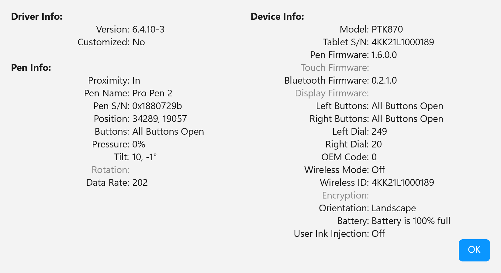

# Windows Pen APIs compared

Here's a quick review of some of the differences between the APIs. This information will be useful if you are building an app or library that has to pick which API to use or switch between APIs.

### Z position

Z position is roughly equivalent "hover height"

| API                | Z (height)            |
| ------------------ | --------------------- |
| Wintab             | `pkZ`                 |
| WM\_POINTER        | Not available         |
| WinUI PointerPoint | Not directly          |
| WPF StylusPoint    | Not directly          |
| RealTimeStylus     | Via `PACKET_PROPERTY` |

### Pressure data

Pressure data comes back a bit differently. While 0 always means "no pressure", the data type, max value, and how many unique values vary. &#x20;

| API                | Pressure type                        | Range                                                                         | Normalization         |
| ------------------ | ------------------------------------ | ----------------------------------------------------------------------------- | --------------------- |
| Wintab             | `pkNormalPressure` (uint)            | 0 to device-specific max (get the device-specific max via `GetMaxPressure()`) | App divides by max    |
| WM\_POINTER        | `POINTER_PEN_INFO.pressure` (uint32) | 0 to 1024                                                                     | App divides by 1024.0 |
| WinUI PointerPoint | `Properties.Pressure` (float)        | 0.0 to 1.0                                                                    | Pre-normalized        |
| WPF StylusPoint    | `PressureFactor` (float)             | 0.0 to 1.0                                                                    | Pre-normalized        |
| RealTimeStylus     | `PACKET_PROPERTY.pkNormalPressure`   | Device-specific                                                               | App normalizes        |

In Wintab, you might notice this field is called `pkNormalPressure` . The "Normal" part does not mean normalized pressure (a pressure from 0 to 1.0). pkNormalPressure means the "normal" means the force applied perpendicular to the tablet surface. Normalize it into the range 0.0 to 1.0 by dividing the value by `GetMaxPressure()`.

### Coordinate precision

There are two coordinate systems in play:

* The tablet digitizer coordinate system
* The screen or desktop coordinate system

Tablet digitizers have much higher internal resolution than the screen. A modern tablet is often specified at 5080 LPI. That is about 200 lines per mm. Some devices are closer to 100 lines per mm.

Most pen APIs expose screen-based coordinates. That is usually fine. If you need tablet-native precision, Wintab is the only practical option in a modern Windows app. To get it, you must configure Wintab to use its digitizer high-resolution context.

Note that **Qt configures the high-resolution context unconditionally**, so every Qt application — Krita among them — is already on tablet-native input. See [Qt always uses the high-resolution context](../misc/krita-and-qt/qt-pen-api-implementation-notes.md#qt-always-uses-the-high-resolution-tablet-native-context) for the code, and for what the screen-pixel mapping costs in measured stroke quality.

<table data-full-width="true"><thead><tr><th>API</th><th>Coordinates</th><th>Precision</th></tr></thead><tbody><tr><td><strong>Wintab (System)</strong></td><td>Physical screen pixels</td><td>Screen resolution (~200 DPI)</td></tr><tr><td><strong>Wintab (Digitizer Hi-Res)</strong></td><td>Tablet native units</td><td>Tablet resolution (up to 5080+ LPI)</td></tr><tr><td><strong>WM_POINTER / WM_POINTERUPDATE</strong></td><td>Physical screen pixels</td><td>Screen resolution¹</td></tr><tr><td><strong>Windows Ink (WinUI PointerPoint)</strong></td><td>DIPs (device-independent pixels)</td><td>DIP resolution</td></tr><tr><td><strong>Windows Ink (WPF StylusPoint)</strong></td><td>WPF device-independent units</td><td>WPF layout resolution</td></tr><tr><td><strong>RealTimeStylus (COM)</strong></td><td>HIMETRIC (0.01mm)</td><td>Up to ~2540 DPI²</td></tr></tbody></table>

#### Coordinate precision comparison

The X ranges below use these example assumptions:

* **Screen pixels (3,840):** one 4K UHD monitor at 3840×2160 physical pixels
* **DIPs (1,707):** the same 4K monitor at 225% scaling, so `3840 / 2.25 = 1707`
* **Tablet native (52,600):** a Wacom Intuos Pro Large PTK-870 with 349mm active width at 5080 LPI
* **HIMETRIC (26,400):** HIMETRIC uses 0.01mm units, so a 264mm-wide tablet is about 26400 units

| API                     | Typical X range                                            | Tablet resolution preserved?                                                                                                    |
| ----------------------- | ---------------------------------------------------------- | ------------------------------------------------------------------------------------------------------------------------------- |
| Wintab System           | 
0 to 3840 (screen pixels on a 4K monitor)
        | No — downscaled to screen pixels                                                                                                |
| Wintab Digitizer Hi-Res | 
0 to 52600 (tablet native, varies by device)
     | **Yes** — full tablet LPI                                                                                                       |
| WM\_POINTER             | 
0 to 3840 (screen pixels on a 4K monitor)
        | 
No — screen pixels See footnote 1
                                                                                     |
| WinUI PointerPoint      | 
0 to 1707 (DIPs on a 4K monitor at 225% scaling)
 | No — DIP resolution                                                                                                             |
| WPF StylusPoint         | Framework-dependent                                        | No — layout resolution                                                                                                          |
| RealTimeStylus          | 
0 to ~26400 (HIMETRIC, varies by tablet width)
   | 
Partial — HIMETRIC is 0.01mm (~2540 units/inch), but actual resolution depends on hardware and driver. See footnote 2
 |

#### Are these high-resolution ranges real?

Wacom’s driver diagnostics make the native resolution visible. On a PTK-870 tablet, values near the bottom-right corner reach roughly:

* `34900` for X
* `19500` for Y

That works out to about 100 lines per mm on both axes.

<figure><figcaption></figcaption></figure>

#### Footnotes

**1. WM\_POINTER precision:** Windows tracks higher-resolution pen input internally, but Win32 exposes `ptPixelLocation` in `POINTER_INFO` as physical screen pixels. `GetPointerInfoHistory` gives more samples, not higher-resolution coordinates.

**2. RealTimeStylus resolution:** The \~2540 DPI figure comes from the HIMETRIC unit definition. It is a unit conversion, not a hardware limit. Actual precision depends on the tablet, driver, and scaling.

### Pen buttons

| API                | Multiple pen buttons                    |
| ------------------ | --------------------------------------- |
| Wintab             | `pkButtons` bitmask                     |
| WM\_POINTER        | Button flags in `POINTER_INFO`          |
| WinUI PointerPoint | `Properties.IsBarrelButtonPressed` etc. |
| WPF StylusPoint    | Via `StylusButton` collection           |
| RealTimeStylus     | Via `PACKET_PROPERTY`                   |

### Barrel pressure

| API                | Barrel pressure       |
| ------------------ | --------------------- |
| Wintab             | `pkTangentPressure`   |
| WM\_POINTER        | Not available         |
| WinUI PointerPoint | Not available         |
| WPF StylusPoint    | Not available         |
| RealTimeStylus     | Via `PACKET_PROPERTY` |

### Eraser detection

| API                | Eraser detection                    |
| ------------------ | ----------------------------------- |
| Wintab             | Via cursor type (`pkCursor`)        |
| WM\_POINTER        | `IS_POINTER_INRANGE_WPARAM` + flags |
| WinUI PointerPoint | `Properties.IsEraser`               |
| WPF StylusPoint    | `StylusDevice.Inverted`             |
| RealTimeStylus     | Via cursor type                     |

### Framework compatibility

**Wintab**

* WinForms, WPF, WinUI 3, and Avalonia work well through P/Invoke or a .NET wrapper.
* Win32 works well with the native `Wintab.h` header.

**WM\_POINTER**

* WinForms works, but needs extra care. `IMessageFilter` is the safest route.
* WPF works through `WndProc` or `HwndSource`.
* WinUI 3 does not expose it directly.
* Avalonia can use platform interop.
* Win32 supports it natively.

**WinUI PointerPoint**

* WinUI 3 supports it natively.
* WinForms, WPF, Avalonia, and raw Win32 do not expose it.

**WPF StylusPoint**

* WPF supports it natively.
* WinForms, WinUI 3, Avalonia, and raw Win32 do not expose it.

**RealTimeStylus**

* WinForms and WPF work through COM interop.
* WinUI 3, Avalonia, and Win32 can use it through COM.

### Hover / proximity behavior

APIs differ in how they report a pen that is near the tablet but not touching it. This affects cursor preview, brush ghosting, and eraser detection.

| API                | Proximity detection                              | Hover data                                                       | Notes                                                                                                                                                         |
| ------------------ | ------------------------------------------------ | ---------------------------------------------------------------- | ------------------------------------------------------------------------------------------------------------------------------------------------------------- |
| Wintab             | `WT_PROXIMITY` message; `pkStatus` proximity bit | Full pen data during hover: position, tilt, buttons, cursor type | Eraser detection happens on hover. The `pkStatus` proximity bit is set when the pen leaves range, not when it enters. Packets stop when the pen leaves range. |
| WM\_POINTER        | `IS_POINTER_INRANGE_WPARAM` flag                 | `WM_POINTERUPDATE` with `INRANGE` but not `INCONTACT`            | Pen data is available during hover. `WM_POINTERLEAVE` fires when the pen exits range.                                                                         |
| WinUI PointerPoint | `PointerEntered` / `PointerExited` events        | `IsInContact` distinguishes hover from press                     | Fits the XAML event model. Hover data includes pressure `0`, tilt, and position.                                                                              |
| WPF StylusPoint    | `StylusInAirMove` event                          | Position and tilt during in-air movement                         | `StylusDevice.InAir` exposes the state. Data is more limited than contact events.                                                                             |
| RealTimeStylus     | `IStylusPlugin::InAirPackets`                    | Position and tilt during hover                                   | Uses a dedicated callback instead of the normal contact packet flow.                                                                                          |

Key differences:

* Wintab provides the richest hover data, including cursor type for eraser detection, but its proximity behavior is quirky.
* WM\_POINTER has cleaner hover semantics, but exposes less pen data.
* Eraser timing differs. Wintab can report cursor changes before contact. WM\_POINTER reports eraser state per event.

### Pen orientation data

Orientation describes how the pen is rotated in space. The main components are tilt and twist.

* **Tilt** is how far the pen leans, and in which direction.
* **Twist** is barrel rotation around the pen’s long axis.

Both are angles. Tilt is usually represented either as altitude plus azimuth, or as `TiltX` plus `TiltY`, depending on the API.



| API                | Tilt representation                                | Twist                                 | Notes                        |
| ------------------ | -------------------------------------------------- | ------------------------------------- | ---------------------------- |
| Wintab             | Azimuth and altitude in tenths of a degree         | `orTwist` from `0` to `3600`          | Full spherical coordinates   |
| WM\_POINTER        | `TiltX` and `TiltY` in degrees from `-90` to `+90` | Rotation in degrees from `0` to `359` | Simpler, but less expressive |
| WinUI PointerPoint | `Properties.XTilt` and `Properties.YTilt`          | `Properties.Twist`                    | Same model as WM\_POINTER    |
| WPF StylusPoint    | `XTiltOrientation` and `YTiltOrientation`          | Not directly available                | Limited                      |
| RealTimeStylus     | Azimuth, altitude, and twist                       | Full                                  | Similar to Wintab            |

Twist support in hardware is rare. It needs both a compatible tablet and a pen with a rotation sensor, such as a Wacom Art Pen. Most pens and most consumer tablets do not report twist in practice.

### Multi-monitor

<table data-full-width="true"><thead><tr><th>API</th><th>Multi-Monitor</th></tr></thead><tbody><tr><td><strong>Wintab (System)</strong></td><td>Works</td></tr><tr><td><strong>Wintab (Digitizer Hi-Res)</strong></td><td>Works, but needs special handling</td></tr><tr><td><strong>WM_POINTER / WM_POINTERUPDATE</strong></td><td>Works</td></tr><tr><td><strong>Windows Ink (WinUI PointerPoint)</strong></td><td>Works</td></tr><tr><td><strong>Windows Ink (WPF StylusPoint)</strong></td><td>Works</td></tr><tr><td><strong>RealTimeStylus (COM)</strong></td><td>Works</td></tr></tbody></table>

### Threading

<table data-full-width="true"><thead><tr><th>API</th><th>Threading</th></tr></thead><tbody><tr><td><strong>Wintab (System)</strong></td><td>Background thread (200+ Hz)</td></tr><tr><td><strong>Wintab (Digitizer Hi-Res)</strong></td><td>Background thread (200+ Hz)</td></tr><tr><td><strong>WM_POINTER / WM_POINTERUPDATE</strong></td><td>UI thread (message-driven)</td></tr><tr><td><strong>Windows Ink (WinUI PointerPoint)</strong></td><td>UI thread</td></tr><tr><td><strong>Windows Ink (WPF StylusPoint)</strong></td><td>UI thread</td></tr><tr><td><strong>RealTimeStylus (COM)</strong></td><td>Configurable (sync or async plugin)</td></tr></tbody></table>

### Cursor follows pen

A comparison of the available APIs for receiving pen or stylus input on Windows, relevant to drawing and handwriting applications.

<table data-full-width="true"><thead><tr><th>API</th><th>Threading</th></tr></thead><tbody><tr><td><strong>Wintab (System)</strong></td><td>Background thread (200+ Hz)</td></tr><tr><td><strong>Wintab (Digitizer Hi-Res)</strong></td><td>Background thread (200+ Hz)</td></tr><tr><td><strong>WM_POINTER / WM_POINTERUPDATE</strong></td><td>UI thread (message-driven)</td></tr><tr><td><strong>Windows Ink (WinUI PointerPoint)</strong></td><td>UI thread</td></tr><tr><td><strong>Windows Ink (WPF StylusPoint)</strong></td><td>UI thread</td></tr><tr><td><strong>RealTimeStylus (COM)</strong></td><td>Configurable (sync or async plugin)</td></tr></tbody></table>
