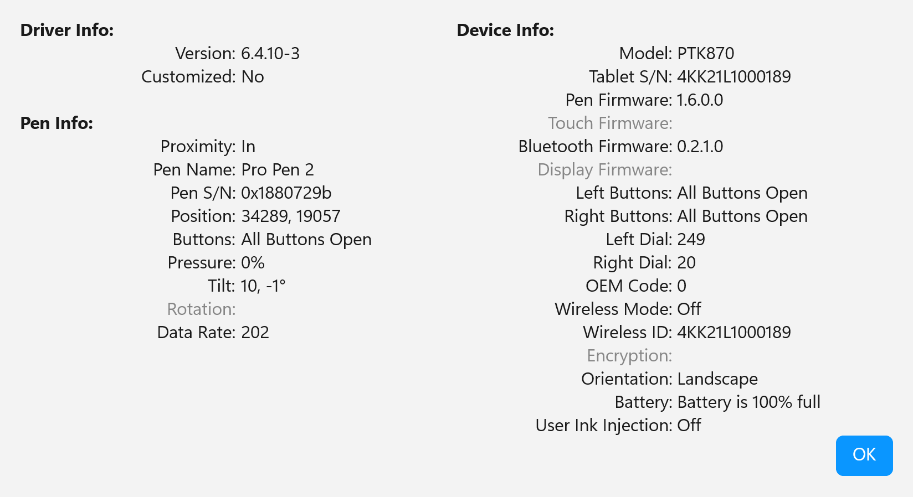

# Coordinate Precision

## Overview

There are (at least) two coordinate systems in play:

* The tablet digitizer coordinate system
* The screen/desktop of your OS

Tablet digitizers have very high resolution internally. For a modern tablet the resolution is specified by the manufacturer as 5080 LPI. Which translates to 200 LPmm. Though some tablets are around 100 LPmm.

But depending on the API you use, you may not have access to that high-resolution data. Most pen APIs operate on screen pixels. For many cases, this is probably fine.

But if you do want high-resolution - as it stands for a modern Windows application, WinTab is the only practical choice. Even then, be aware, you have to use configure WinTab to use its high-resolution mode (referred to as the "Digitizer Context" in WinTab terminology).

## Coordinate precision comparison

The X ranges below are examples based on these assumptions:

* **Screen pixels (3,840):** a single 4K UHD monitor (3840×2160 physical pixels)
* **DIPs (1,707):** the same 4K monitor at 225% display scaling (3840 / 2.25 = 1,707 DIPs)
* **Tablet native (52,600):** a Wacom Intuos Pro Large PTK-870 (349mm active width at 5080 LPI = \~52,600 native units). Other tablets will differ — smaller tablets or lower-resolution models produce smaller ranges
* **HIMETRIC (264,000):** HIMETRIC units are 0.01mm, so a 264mm-wide tablet = \~264,000 units

| API                     | Typical X range                                            | Tablet resolution preserved?                                                                                                         |
| ----------------------- | ---------------------------------------------------------- | ------------------------------------------------------------------------------------------------------------------------------------ |
| Wintab System           | 
0 to 3840 (screen pixels on a 4K monitor)
        | No — downscaled to screen pixels                                                                                                     |
| Wintab Digitizer Hi-Res | 
0 to 52600 (tablet native, varies by device)
     | **Yes** — full tablet LPI                                                                                                            |
| WM\_POINTER             | 
0 to 3840 (screen pixels on a 4K monitor)
        | 
No — screen pixels See footnote 1
                                                                                          |
| WinUI PointerPoint      | 
0 to 1707 (DIPs on a 4K monitor at 225% scaling)
 | No — DIP resolution                                                                                                                  |
| WPF StylusPoint         | Framework-dependent                                        | No — layout resolution                                                                                                               |
| RealTimeStylus          | 
0 to ~264,000 (HIMETRIC, varies by tablet width)
 | 
Partial — HIMETRIC unit is 0.01mm (~2540 units/inch), but actual resolution depends on hardware and driver. See footnote 2
 |

## Are these high-resolution ranges real?

We are right to be skeptical of listed specs.\
But it is easily seen in the Wacom driver UI that their tablets do have such a high resolution.

Here's a screenshot of the tablet diagnostics reporting the position of the pen very close to the bottom right corner of the PTK-870 tablet.&#x20;

<figure><figcaption></figcaption></figure>

The maximum values I can achieve are

* 34900 for X
* 19500 for Y

So 34900 lines / 349mm = 100 LPI&#x20;

So 19500 lines / 195 mm = 100 LPI

## Footnotes

**¹ WM\_POINTER precision:** The Windows pointer input stack internally tracks higher-resolution input from the tablet hardware, but coordinates exposed via Win32 APIs (`ptPixelLocation` in `POINTER_INFO`) are quantized to physical screen pixels. Higher-frequency sampling is available via `GetPointerInfoHistory`, but the coordinate space remains screen pixels — you do not get tablet-native resolution as with Wintab Digitizer Hi-Res.

**² RealTimeStylus resolution:** The "2540 DPI" figure comes from the HIMETRIC unit definition (1 HIMETRIC = 0.01mm, and 25.4mm/inch = 2540 units/inch). This is a unit conversion, not a hardware limit. Actual coordinate resolution depends on the tablet hardware, driver, and packet scaling. High-end tablets with 5080+ LPI may deliver more precision than the HIMETRIC grid can represent; lower-end devices may deliver less. RTS gives higher resolution than screen pixels but is not guaranteed to match modern tablet LPI.
