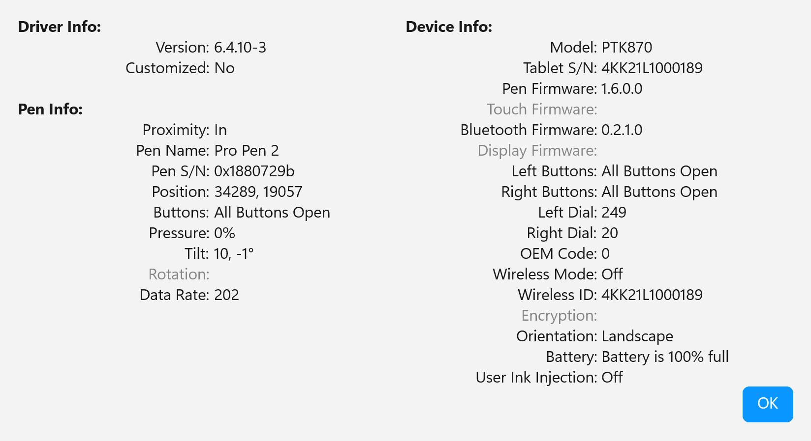

# Stage 4: Position: device units to desktop pixels

This stage turns whatever position an API reports (tablet counts, HIMETRIC, screen pixels or a framework's logical units) into one coordinate space: physical pixels on the virtual desktop, as a `double`. Three things can go wrong here. The position can be in the wrong space, which puts the stroke a growing distance away from the pen. It can lose its fractional part, which makes slow curves look faceted. Or the driver's mapping can disagree with the real desktop, which offsets the stroke by hundreds of pixels on some multi-monitor setups.

## In short

- Make the process Per-Monitor V2 DPI aware (manifest, project property or `SetProcessDpiAwarenessContext`, per framework) and check it at runtime with `L0.dpi-awareness`.
- Keep positions as `double` from the source to the canvas; read `ptHimetricLocationRaw` through `GetPointerDeviceRects` on WM\_POINTER, and map Wintab high-res counts onto `lcSys` with `ScaleAxis`.
- Do not pass a pen position through `PointToScreen` or any other API that takes an integer `POINT`; convert only the window or element origin that way.
- Call `RefreshMapping()` after a display change; it re-reads the mapping only on `WintabDigitizerSession`, and does nothing on the other sessions.
- Do not assume a Wintab driver's `lcSys` matches the physical desktop on a mixed-DPI setup; check a new driver with the mapping wizard and offer WM\_POINTER as an alternative.

## The problem

Each API reports position in its own unit:

| API | unit it reports | relative to |
| --- | --- | --- |
| Wintab system context | screen pixels, integer | the virtual desktop |
| Wintab high-res (digitizer) context | tablet counts, integer | the tablet, Y up |
| WM\_POINTER | `ptPixelLocationRaw` in pixels (integer) and `ptHimetricLocationRaw` in HIMETRIC (integer, finer) | the virtual desktop, and the device rect |
| WPF stylus | DIPs, `double` | the element |
| WinUI 3 `PointerPoint` | effective pixels (DIPs), `double` | the element |
| Avalonia pointer | DIPs, `double` | the element |
| RealTimeStylus | HIMETRIC (0.01 mm) | the device |

A tablet resolves far more finely than a screen. Tablets are commonly specified at 5080 LPI, about 200 lines per mm; some report closer to 100 lines per mm. A screen at about 200 DPI has about 8 pixels per mm. Two worked figures:

* Qt's notes record a tablet with an input extent of 52885 x 29835 counts mapped to a 7680 x 3600 virtual desktop: about 7 counts per pixel.
* WinPenKit's `WmPointerSession` source notes that `ptHimetricLocationRaw` is about 7 times finer than `ptPixelLocationRaw` on a typical display.

The tablet counts are real. Wacom's driver diagnostics on a PTK-870 showed values near the bottom-right corner of about 34900 for X and 19500 for Y, which the earlier notes worked out as about 100 lines per mm on both axes. Earlier notes also gave the PTK-870 range as 0 to 52,600 at 5080 LPI; that matches neither the specification (349 mm at 5080 lines per inch is about 69,800) nor these diagnostics, so use the counts the driver reports, not the marketed LPI.



Whole pixels are a measurable loss. A tablet reports steps of about 2 px, and on an integer grid a 2 px step can point in only a few directions: 11.31° is `atan(1/5)`, and its neighbours are `atan(1/3)` = 18.43° and 45°. On one recorded stroke the median turn between consecutive segments was 1.50° with sub-pixel coordinates and 11.31° after quantizing to whole pixels (p90 5.10° against 26.57°, max 9.83° against 45.00°). Rounding instead of truncating gives the same result, because the grid causes the effect, not the rounding rule. [Stage 8](8-verifying.md) explains how to measure this.

## DPI awareness comes first

Every conversion in this stage and the next assumes the process is **Per-Monitor V2** DPI aware. Microsoft's [High DPI Desktop Application Development on Windows](https://learn.microsoft.com/en-us/windows/win32/hidpi/high-dpi-desktop-application-development-on-windows) describes the full model. The levels that matter for pen input:

| level | introduced | what Win32 returns |
| --- | --- | --- |
| DPI Unaware | default before Vista, and still the default for a raw Win32 app | virtualized coordinates, as if every display were 96 DPI. Windows bitmap-scales the output, so it is blurry |
| System DPI Aware | Vista | the primary monitor's DPI, fixed at startup. Correct on monitors at that DPI, virtualized on the others |
| Per-Monitor V1 | Windows 8.1 | `WM_DPICHANGED` on a monitor change, but dialog sizing and the non-client area still use the wrong DPI |
| Per-Monitor V2 | Windows 10 1703 | physical pixels from `ClientToScreen` and `ScreenToClient`, the real DPI from `GetDpiForMonitor` (for example 216 at 225%), and correct scaling of the non-client area and child windows |

A Wintab driver reports positions in its own screen space whatever the process's awareness, and for Wacom that space is the physical desktop. In a process that is not Per-Monitor V2, the Win32 calls an application uses to find its window (`ClientToScreen`, `ScreenToClient`, the framework methods built on them) return virtualized values, so subtracting one from the other gives an error that grows with distance from the desktop origin. `Scribble.Wpf` showed this before it had a manifest: the process was System DPI aware, and strokes landed up and to the left of the pen. For `lcSys` specifically, one measurement on the Huion V20 driver read the same `WTI_DEFSYSCTX` values from Unaware, System-aware, Per-Monitor and Per-Monitor V2 processes. Whether the packet positions themselves change with the caller's awareness has not been tested. WM\_POINTER pixel coordinates are reported in the process's DPI awareness context.

Per-Monitor V2 fixes the coordinate space only. It does not fix precision: `ClientToScreen`, `ScreenToClient` and the framework methods built on them still take an integer `POINT`. [Stage 5](5-desktop-to-canvas.md) covers that.

### How each framework gets Per-Monitor V2

The older notes in this site disagreed on the defaults. The table below follows what the WinPenKit samples actually do, which [Build a Scribble app: framework deltas](../../build-a-scribble-app/framework-deltas.md) also describes.

| framework | how the WinPenKit sample claims Per-Monitor V2 | notes |
| --- | --- | --- |
| Win32 (C++) | `SetProcessDpiAwarenessContext(DPI_AWARENESS_CONTEXT_PER_MONITOR_AWARE_V2)` before creating any window | the default is DPI Unaware |
| WinForms (.NET 10) | `<ApplicationHighDpiMode>PerMonitorV2</ApplicationHighDpiMode>` in the `.csproj` | an older note named the property `HighDpiMode`; the sample uses `ApplicationHighDpiMode`. Whether Per-Monitor V2 is the default without the property is not verified |
| WPF (.NET 10) | `app.manifest` with `<dpiAwareness>PerMonitorV2</dpiAwareness>` and `<dpiAware>true/pm</dpiAware>` | an older note said .NET 10 WPF is Per-Monitor V2 automatically. The sample's manifest records that without it the process was System DPI aware. The manifest also needs the Windows 10 `supportedOS` entry, or Windows ignores the setting |
| WinUI 3, packaged (MSIX) | the package manifest | |
| WinUI 3, unpackaged (`WindowsPackageType=None`) | `app.manifest`, the same two elements and `supportedOS` entry as WPF | an older note said the Windows App SDK sets it at startup. WinPenKit always ships the manifest, so running without one is not verified. Without it, the earlier notes report a blurry UI and drifting pen coordinates |
| Avalonia | the framework | |
| Rust / egui (eframe) | the framework | |

The manifest for WPF and unpackaged WinUI 3:

```xml
<application xmlns="urn:schemas-microsoft-com:asm.v3">
  <windowsSettings>
    <dpiAwareness xmlns="http://schemas.microsoft.com/SMI/2016/WindowsSettings">PerMonitorV2</dpiAwareness>
    <dpiAware xmlns="http://schemas.microsoft.com/SMI/2005/WindowsSettings">true/pm</dpiAware>
  </windowsSettings>
</application>
```

Do not rely on a default. `SelfTest.CheckDpiAwareness` (`L0.dpi-awareness`) reads the thread's actual context at runtime and fails on anything other than Per-Monitor V2.

### Setting the thread's context explicitly

A thread can hold a different DPI awareness context from its process, and the thread's context decides which space Win32 calls answer in. WinPenKit's WinUI session sets it explicitly around the two calls whose results must be physical:

```csharp
var old = SetThreadDpiAwarenessContext(DPI_AWARENESS_CONTEXT_PER_MONITOR_AWARE_V2);
try
{
    ClientToScreen(hwnd, ref clientOrigin);         // physical pixels
    GetDpiForMonitor(hMon, 0, out dpiX, out dpiY);  // the real DPI
}
finally
{
    SetThreadDpiAwarenessContext(old);
}
```

| handle | value | meaning |
| --- | --- | --- |
| `DPI_AWARENESS_CONTEXT_UNAWARE` | -1 | virtualized values |
| `DPI_AWARENESS_CONTEXT_SYSTEM_AWARE` | -2 | System DPI aware |
| `DPI_AWARENESS_CONTEXT_PER_MONITOR_AWARE` | -3 | Per-Monitor V1 |
| `DPI_AWARENESS_CONTEXT_PER_MONITOR_AWARE_V2` | -4 | Per-Monitor V2, the one to use |
| `DPI_AWARENESS_CONTEXT_UNAWARE_GDISCALED` | -5 | DPI unaware with improved GDI scaling |

The earlier notes report WinUI 3 coordinates drifting when `ClientToScreen` ran without this. WinPenKit has no recorded case where it was needed in a WinUI process whose manifest already declares Per-Monitor V2, so treat it as a safeguard. WinForms needs no thread switch, because the whole process is Per-Monitor V2 from startup.

## How the APIs differ here

### Wintab system context

The driver maps the tablet to the screen and `pkX`/`pkY` arrive as physical desktop pixels. There is nothing to convert, and nothing below a whole pixel to keep. Two details:

* **Y is inverted.** The tablet's origin is bottom-left with Y increasing upward; the screen's is top-left. A system context gets screen orientation by negating `lcOutExtY` before opening.
* **The driver owns the multi-monitor mapping.** Setting `lcOutExtX/Y` to your canvas size does not work across monitors: the earlier notes record the Wacom driver clipping a custom output range to the mapped monitor's fraction of the virtual desktop. Use the system context's own output range, or the high-res context. WinPenKit never sets a custom output range, so it does not exercise this.

### Wintab high-res (digitizer) context

Packets arrive in tablet counts, because the output range is set to the input range ([Stage 1](1-source.md#two-wintab-modes-one-context-type) explains this context), so the application maps them to the desktop itself. Qt does the same; see [Qt always uses the high-resolution context](../../misc/krita-and-qt/qt-pen-api-implementation-notes.md#qt-always-uses-the-high-resolution-tablet-native-context) for Qt's four assignments and its floating-point mapping.

The mapping target is the driver's `lcSysOrg`/`lcSysExt`: the screen rectangle the driver maps the tablet to. Each axis goes through Wintab's `ScaleAxis` equation, in `double`:

```
same sign of inExt and outExt:      out = (in - inOrg) * |outExt| / |inExt| + outOrg
opposite signs (the axis flips):    out = (|inExt| - (in - inOrg)) * |outExt| / |inExt| + outOrg
inExt == 0:                         out = outOrg
```

The Y flip comes from giving the Y axis a negative output extent (`-|lcSysExtY|`), which selects the second form.

### WM\_POINTER

`POINTER_INFO` carries the position twice. `ptPixelLocationRaw` is in whole screen pixels. `ptHimetricLocationRaw` is finer, and the earlier statement in this site that WM\_POINTER exposes only pixel positions is wrong. Despite the documentation calling it "screen coordinates in HIMETRIC units", its value is expressed in the device's own rectangle, so turning it into a desktop position is a normalization between two rectangles that `GetPointerDeviceRects` returns: the device rect (HIMETRIC) and the display rect (screen pixels).

```
desktopX = display.Left + (himetricX - device.Left) / device.Width  * display.Width
desktopY = display.Top  + (himetricY - device.Top)  / device.Height * display.Height
```

Measured on a Wacom through Windows Ink, the median turn between consecutive segments was 11.31° from the pixel field and 2.54° from the HIMETRIC one. Rounding the HIMETRIC-derived position reproduced the pixel field exactly on 372 of 372 samples on both axes, so nothing is given up by reading it. `GetPointerInfoHistory` adds more samples; it does not change their resolution.

### Framework APIs

WPF, WinUI 3 and Avalonia report positions in logical units relative to an element, as `double`. They carry sub-pixel positions: in the hand-drawn recordings in WinPenKit's `testdata` from each of the three, fewer than 1% of points lie within 0.001 px of a whole pixel. Getting to desktop pixels takes the element's origin in desktop pixels plus the position times the scale. The origin of the **window** is an integer and passes through an integer API without change; the position must not.

* **WPF.** `StylusEventArgs.GetStylusPoints(element)` returns sub-pixel DIPs. `Visual.PointToScreen` then truncates each one to a whole device pixel, so the precision is lost one call after it arrives.
* **WinUI 3.** No framework conversion exists, so you call `ClientToScreen` for the window origin and scale `TransformToVisual(null)` plus the position by the monitor's DPI over 96.
* **Avalonia.** On Windows, Avalonia itself reads `ptHimetricLocationRaw` through `GetPointerDeviceRects`, falling back to whole pixels where that API is missing. `TopLevel.PointToScreen` returns a `PixelPoint` of two `int`, so use it only for the window origin. The framework-deltas page records that Avalonia fixed its own internal quantization in 11.3; the exact change is not yet cited.
* **WinForms** has no pen API. WinPenKit reads WM\_POINTER through an `IMessageFilter`, so it is the WM\_POINTER case above.

### RealTimeStylus

RealTimeStylus reports HIMETRIC, 0.01 mm, which is about 2540 units per inch. That figure comes from the unit definition; the actual precision depends on the tablet, the driver and the scaling. WinPenKit has no RealTimeStylus backend.

### Summary

| API | what reaches desktop pixels | sub-pixel? |
| --- | --- | --- |
| Wintab system | driver pixels, used as is | no |
| Wintab high-res | tablet counts through `ScaleAxis` onto `lcSys` | yes |
| WM\_POINTER | HIMETRIC through `GetPointerDeviceRects`, pixel fallback | yes, unless the fallback is taken |
| WPF, WinUI 3, Avalonia | logical position x scale + element origin | yes, if the origin is converted and the position is not |
| RealTimeStylus | HIMETRIC | depends on hardware and driver |

## Mixed-DPI desktops and multiple monitors

Every API works on more than one monitor. The Wintab high-res context needs the extra care, because the application does the mapping and trusts the driver's `lcSys` to describe the physical desktop.

That trust is correct for Wacom and wrong for at least one other driver. WinPenKit's mapping wizard (below) compares each API's position with the cursor, which Windows places on the physical desktop correctly.

* **Wacom** (Cintiq 16, Wintab32 1.0.5-10): passed all 24 wizard steps, with the tablet mapped to one display or to all displays and every scaling mix. This result is recorded in WinPenKit's `MAPPING-WIZARD.md` and commit history; the session data for it is not in the repository's `testdata`.
* **Huion V20** (Wintab32 20.0.0.4), on a 3840x2160 monitor at 250% above a 2560x1600 one at 225%: the driver reported its screen as 3840x4178 against a real 3840x3760, and sent X values up to 4241 against its reported width of 3840. With the tablet mapped to one display, positions were the physical position times the primary monitor's scaling over the lowest monitor's, which put the stroke up to about 400 px from the nib, the error growing toward the right and bottom. With the tablet mapped to all displays, part of the other monitor was rescaled and part was not, depending on where the pen had been. WM\_POINTER was correct in every case. The data is in WinPenKit's `testdata/mapping-wizard-2026-09-28/`.

Asking the Huion driver for raw counts did not avoid the error: the full 50800-count width landed on 3457 px of a 3840 px monitor, the same 0.9 factor as the system context, and counts up to 56195 arrived against a stated `lcInExt` of 50800. Applications that look correct on such a desktop (Qt's mouse mode, Blender's trust gate, Clip Studio Paint's "mouse mode" advice) fall back to the system cursor and give up sub-pixel precision to do it. [WINTAB-MAPPING-PRIOR-ART.md](https://github.com/TheSevenPens/WinPenKit/blob/main/Docs/WINTAB-MAPPING-PRIOR-ART.md) compares how Qt, Krita, GTK, Blender and others map Wintab positions.

What an application should do:

1. Be Per-Monitor V2.
2. Call `RefreshMapping()` when the display configuration changes (`WM_DISPLAYCHANGE`, a monitor added or removed, a scaling change, a tablet remap). A scaling change on a monitor other than the window's sends that window no `WM_DPICHANGED`. In WinPenKit only `WintabDigitizerSession.RefreshMapping()` does anything (it re-reads `WTI_DEFSYSCTX`); on every other session it is empty. `WmPointerSession` reads `GetPointerDeviceRects` again only when the source device changes, so its display rect is not refreshed by this call. None of the Scribble samples call `RefreshMapping()` at present. Wacom's ScribbleDemo reopens its contexts on `WM_DISPLAYCHANGE` instead; whether an open context follows a display change without a reopen is not verified.
3. Check a new driver with the mapping wizard before relying on its high-res positions, and offer WM\_POINTER as an alternative for drivers that fail.

## How WinPenKit handles it

* [`WintabSystemSession`](https://github.com/TheSevenPens/WinPenKit/blob/main/WinPenKit/Wintab/WintabSystemSession.cs) opens `WTI_DEFSYSCTX` with `CXO_SYSTEM | CXO_MESSAGES`, negates `lcOutExtY` if it is positive, and returns `pkX`/`pkY` unchanged from `ConvertCoordinates`. `Conventions.RawUnits` is `ScreenPixels`.
* [`WintabDigitizerSession`](https://github.com/TheSevenPens/WinPenKit/blob/main/WinPenKit/Wintab/WintabDigitizerSession.cs) reads `WTI_DEFSYSCTX`, caches `lcInOrg`/`lcInExt` and `lcSysOrg`/`lcSysExt` in `CacheSystemMapping` (with `_mapSysExtY = -Math.Abs(lc.lcSysExtY)`), then opens a context with `lcOutOrg`/`lcOutExt` set to `lcInOrg`/`lcInExt`. `ConvertCoordinates` calls `WintabSessionBase.ScaleAxis` on each axis. `RefreshMapping()` re-reads `WTI_DEFSYSCTX` and re-caches the mapping. If the high-res open fails, `OpenFallback` opens a system context and sets `_useScaleAxis = false`, which also changes `Conventions.RawUnits` from `TabletNative` to `ScreenPixels` and clears `PenCapabilities.HiRes`. The native DLL has the same arithmetic in [`scale_axis.h`](https://github.com/TheSevenPens/WinPenKit/blob/main/WinPenKit.Native/src/scale_axis.h) and `pen_session_refresh_mapping`.
* WinPenKit takes Wacom as the reference and does not correct for any other driver. PR #130 added a correction (`WintabDesktopMap`) for the distortion described above; PR #131 removed it once the distortion was traced to the Huion driver. There is no cursor-based correction.
* [`WmPointerSession`](https://github.com/TheSevenPens/WinPenKit/blob/main/WinPenKit/Pointer/WmPointerSession.cs) `ResolvePosition` caches `GetPointerDeviceRects` per `sourceDevice` and maps `ptHimetricLocationRaw` as above. If the rects cannot be read, or the device rect is empty, it uses `ptPixelLocationRaw` and clears `PenCapabilities.HiRes`. `RawX`/`RawY` carry `ptHimetricLocationRaw`. `WinFormsPointerSession` duplicates the same code.
* [`WpfStylusSession`](https://github.com/TheSevenPens/WinPenKit/blob/main/WinPenKit.Wpf/WpfStylusSession.cs) converts each stylus point with [`WpfCoordinates.GetTransform`](https://github.com/TheSevenPens/WinPenKit/blob/main/WinPenKit.Wpf/WpfCoordinates.cs): `OriginX + sp.X * ScaleX`, never `PointToScreen`.
* [`WinUiPointerSession`](https://github.com/TheSevenPens/WinPenKit/blob/main/WinPenKit.WinUI/WinUiPointerSession.cs) `ElementDipsToDesktopPixels` adds the element origin from `TransformToVisual(null)`, then multiplies by `GetDpiForMonitor` / 96 and adds the `ClientToScreen` origin, both read under a Per-Monitor V2 thread context.
* [`AvaloniaPointerSession`](https://github.com/TheSevenPens/WinPenKit/blob/main/WinPenKit.Avalonia/AvaloniaPointerSession.cs) uses `TranslatePoint` to the `TopLevel`, then `windowOrigin + elementPos * RenderScaling`, with `PointToScreen` used only for the window origin.
* The three framework sessions have no device-native position, so they write `RawX`/`RawY` as 0 with `RawUnits.None` rather than a truncated copy of `DesktopX`.

## Traps

1. **The process is not Per-Monitor V2.** Symptom: the stroke drifts away from the pen as you move right and down, or is correct on the primary monitor only. Fix: claim Per-Monitor V2 as in the table above, and check it with `L0.dpi-awareness`.
2. **WinUI 3 unpackaged without a manifest.** Symptom: blurry UI and drifting coordinates. Fix: `app.manifest` with `PerMonitorV2` and the `supportedOS` entry.
3. **Reading `ptPixelLocationRaw`.** Symptom: faceted strokes on WM\_POINTER, median turn near 11°. Fix: read `ptHimetricLocationRaw` and normalize through `GetPointerDeviceRects`.
4. **Treating `ptHimetricLocationRaw` as 0.01 mm from the screen origin.** Symptom: a scaled or offset position. Fix: normalize between the device rect and the display rect.
5. **Forgetting the Y flip.** Symptom: vertical movement inverted. Fix: negate `lcOutExtY` on a system context, or give the Y axis a negative output extent in `ScaleAxis` on a high-res context. Note that `RawY` from a high-res context is still in tablet orientation, Y up.
6. **Mapping high-res counts through an integer.** Symptom: the high-res context draws exactly like the system context. Fix: keep the result in floating point all the way to the canvas.
7. **Setting `lcOutExt` to the canvas size.** Symptom: wrong positions on multi-monitor setups. Fix: use the system context's output range, or tablet counts with `ScaleAxis`.
8. **Never refreshing the mapping.** Symptom: positions offset after a monitor or scaling change. Fix: call `RefreshMapping()` on `WM_DISPLAYCHANGE` (it has an effect on the Wintab high-res session only).
9. **Assuming every driver's `lcSys` is the physical desktop.** Symptom: an offset of hundreds of pixels on a mixed-DPI desktop, growing toward the right and bottom, while WM\_POINTER is correct. Fix: run the mapping wizard against that driver and offer WM\_POINTER.
10. **Converting WPF stylus points with `PointToScreen`.** Symptom: faceted strokes from a sub-pixel source. Fix: `WpfCoordinates.GetTransform`.

## Further reading

* [Stage 3: Timing](3-timing.md) and [Stage 5: desktop pixels to your canvas](5-desktop-to-canvas.md), the stages on either side.
* [Stage 8: Verifying the pipeline](8-verifying.md), for `L0.dpi-awareness`, the mapping probe and the mapping wizard.
* [Build a Scribble app: framework deltas](../../build-a-scribble-app/framework-deltas.md), per-framework units and scale sources.
* [Qt pen API implementation notes](../../misc/krita-and-qt/qt-pen-api-implementation-notes.md), Qt's high-res context and its checklist.
* WinPenKit: [MAPPING-WIZARD.md](https://github.com/TheSevenPens/WinPenKit/blob/main/Docs/MAPPING-WIZARD.md), [WINTAB-MAPPING-PRIOR-ART.md](https://github.com/TheSevenPens/WinPenKit/blob/main/Docs/WINTAB-MAPPING-PRIOR-ART.md).
